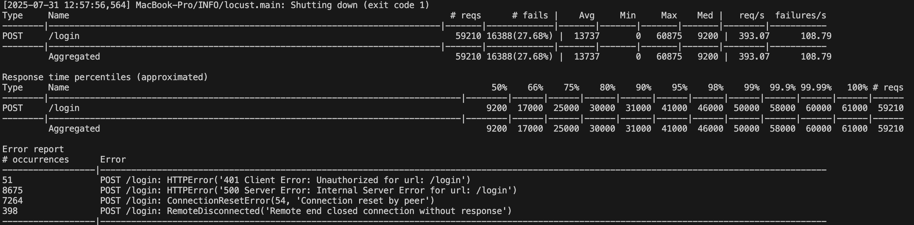

# FastAPI Email+Password Login Service

This demo project implements a login API using FastAPI and asynchronous SQLAlchemy ORM. It supports:

- User login by email and password (plaintext for demo)
- Updating user's last access time and login count on successful login
- Logging each login action into a `log` table
- Pre-inserting 1000 user records for performance testing
- Clean up any test data records when shutting down

---


## Setup

1. Clone the repo

   ```bash
   git clone https://github.com/YOUR_USERNAME/YOUR_REPO.git
   cd YOUR_REPO
   ```
2. Install requirements

   ```bash
   pip install fastapi uvicorn sqlalchemy asyncpg psycopg
   ```
3. Run up locally

   ```bash
   uvicorn main:app --host 0.0.0.0 --port 8000 --reload
   ```
---

## Load test result

Have 10000 users spawned at the rate 100/s running for 150s:
  
   ```bash 
   locust -f loadtest.py --headless -u 10000 -r 100 --run-time 150s --host http://localhost:8000
   ```
   
